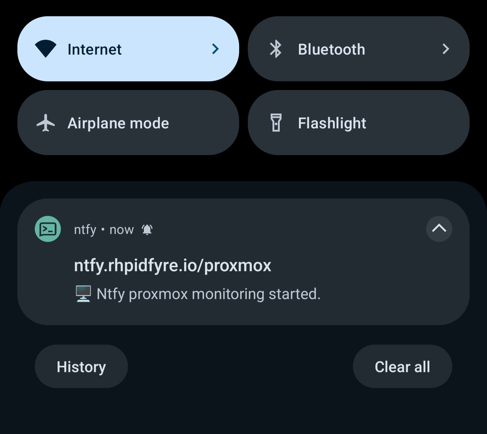

# Proxmox ntfy
### Monitor your proxmox datacenter with phone notifications


# Prerequisites
* [Ntfy](https://ntfy.sh/)
* [Proxmoxer](https://pypi.org/project/proxmoxer/)
* python3
* python3-requests (It's possible to use `curl` instead with Python [subprocess](https://docs.python.org/3/library/subprocess.html)) [*Optional]

# Deploying
This example will utilize [tmux](https://github.com/tmux/tmux/wiki):

1. Create a new named session, "ntfy" will be used as an example:
```
tmux [new|new-session] -s ntfy
```
2. Enter the new session:
```
tmux attach -t ntfy
```
3. Download and start the script:
```
git clone --depth=1 https://github.com/unixtensor/proxmox-ntfy
python3 ./proxmox-ntfy/src/main.py http://your.domain.com/
```

Detatch from the current tmux session with `<Ctrl b><d>`, the script should now be deployed and running in the background.

## Updating
You can update the script without cloning the project using git:
```
git pull
```